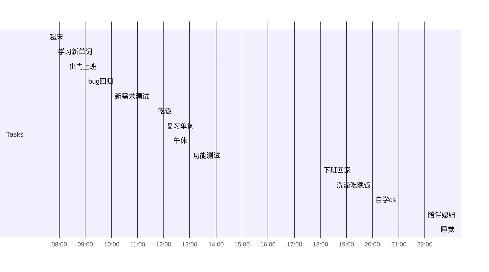

## Day Planner

- [ ] 07:30 起床
- [ ] 07:50 学习新单词
- [ ] 08:15 出门上班
- [ ] 09:00 bug回归
- [ ] 10:00 新需求测试
- [ ] 11:40 吃饭
- [ ] 12:00 复习单词
- [ ] 12:15 午休
- [ ] 13:00 功能测试
- [ ] 18:00 下班回家
- [ ] 18:30 洗澡吃晚饭
- [ ] 20:00 自学cs
- [ ] 22:00 陪伴媳妇
- [ ] 22:30 睡觉